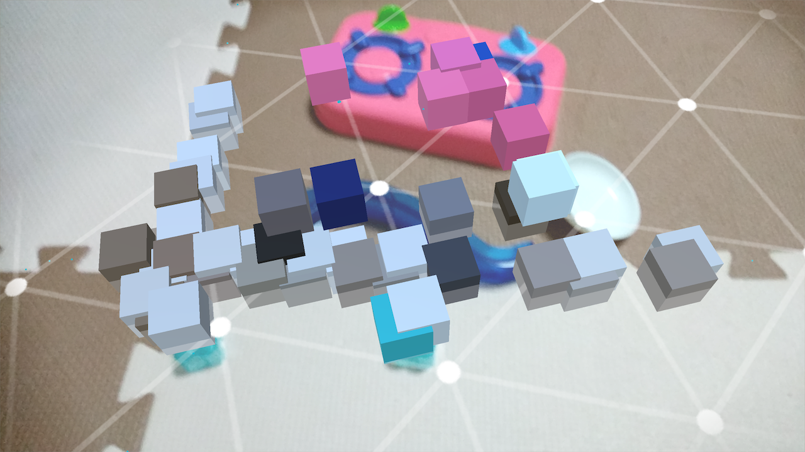

# drawmesh_Unity_arcore

  

# Feature

Showing featurepoint as cube color mesh on ARCore

# How to build

Unity2017.4.4f1  (Other unity version is not confirmed)  
ARCore1.2 (Other version is not confirmed)  
Android8.1.0, 10.0  
jdk1.8.0_171.jdk  

1. clone the repository and open Unity.

2. Select MyWork/Scene/DrawMesh  

3. Select Project Settings and set as an Android app.

4. Build and run

# Usage

Run the app and look around.  Each feature points are showed as color cube mesh.  

drawmesh.apk is built app. You can also use it.  

# Reference  

Japanese posts  
[【Unity】任意のパスにARCore Point Cloudの値をcsvで書き出す](https://www.crossroad-tech.com/entry/ARcore_PointCloud1)  

[ARCoreで保存したPoint Cloudを色付きでUnityに出力しました](https://www.crossroad-tech.com/entry/ARcore_PointCloud2)  